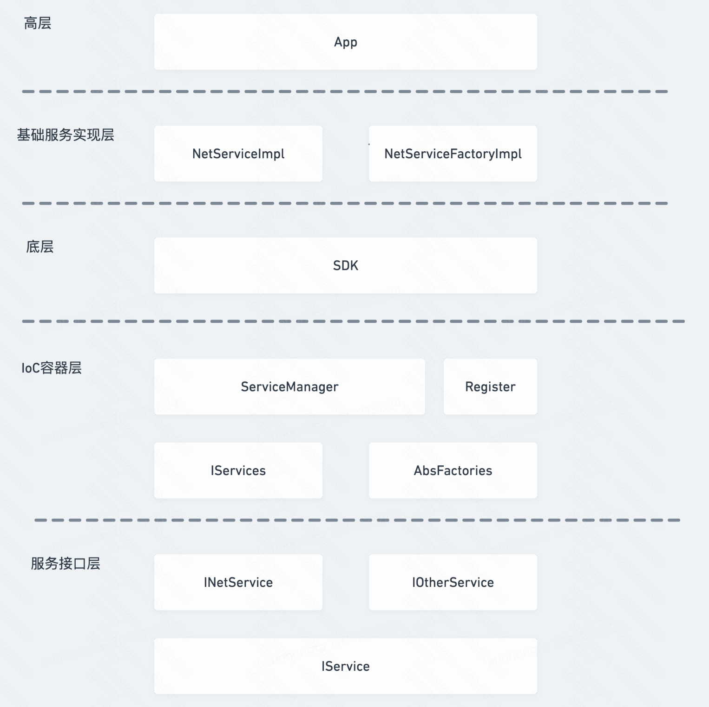

# IoC

## 简介
IoC(Inversion of Control)，控制反转，与接口编程同时使用时，依赖别人者不会因被依赖者改变而改变，达到了高度的松耦合

假定我们要开发一个SDK，来实现一个广告流展示的功能。那么可能用到的一些基础组件，如：网络库、图片加载框架等。那么如果说我们直接在SDK中依赖了这些基础组件，那么宿主接入SDK会面临几个问题。

若宿主引用了Glide，而SDK引用了fresco，两套图片加载框架，增加了包大小
若基础组件和SDK都引用的Glide，但版本不同，可能有版本不兼容的风险
随着SDK有更多基础组件的依赖，依赖关系会越来越复杂

如果将SDK的基础功能抽象成接口，真正的实现交给宿主，宿主再将这些实现注入到SDK的接口容器中，SDK在需要某接口功能时，去容器中去get，那么SDK就不在需要依赖这些基础组件了。

解决这一问题的核心方案就是IoC，实现IoC常见的方式为依赖注入（DI：Dependency Injection），它解决了一个最主要的问题：将基础组件的创建与基础组件的使用相分离，并且由IoC容器负责管理组件。

Ioc是一种反转、依赖和接口的方式。就是将控制权“往高处/上层”转移，依赖倒置是实现控制反转的一种方法（DIP<依赖倒置原则>的具体实现方式）

## APT+AOP进阶IoC
解决底层与高层依赖冲入的主要思想就是由底层来定义接口，IoC容器用来注入高层实现的一些基础服务，这些基础服务注册进来的是IXXXService.class和对应的初始化Factory

- 服务接口层：用来定义底层需要的基础接口
- IoC容器层：用来存储高层通过Register注入的基础接口的class与factory的映射集，ServiceManager可以get到相应的service实例
- 底层：SDK依赖IoC容器层，获取需要的Service实例
- 基础服务实现层：依赖服务接口层，可由高层实现
- 高层：app侧，需要通过Register注入基础服务实现
  高层需要自己实现Factory，并且在初始化的时候，把不同模块的Factory注入到IoC容器中，我们有没有更好地方式去实现呢

Android同学可能接触过Dagger、ButterKnife等，通过注解的方式生成依赖代码，简化了代码量，我们也可以通过这种方式去优化依赖注入。

前文提到的Factory是初始化相应的Service，因为一个模块可能有多个Factory，所以需要一个ServiceRegister去注册多个Factory。

而ServiceRigisterCollection(IoC层的Register)就是调用ServiceRegister。这两部分都是一些有规律的代码，我们可以通过APT去生成Factory，通过AOP将相关映射注入到ServiceRigisterCollection中。
